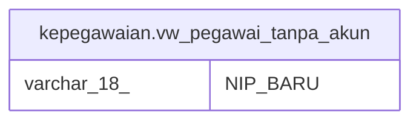

# kepegawaian.vw_pegawai_tanpa_akun

## Description

<details>
<summary><strong>Table Definition</strong></summary>

```sql
CREATE VIEW vw_pegawai_tanpa_akun AS (
 SELECT pegawai."NIP_BARU"
   FROM (((kepegawaian.pegawai pegawai
     LEFT JOIN kepegawaian.vw_unit_list vw ON (((pegawai."UNOR_ID")::text = (vw."ID")::text)))
     LEFT JOIN kepegawaian.pns_aktif pa ON ((pegawai."ID" = pa."ID")))
     LEFT JOIN kepegawaian.jabatan ON ((pegawai."JABATAN_INSTANSI_ID" = (jabatan."KODE_JABATAN")::bpchar)))
  WHERE ((pa."ID" IS NOT NULL) AND ((pegawai."KEDUDUKAN_HUKUM_ID")::text <> ALL (ARRAY[('14'::character varying)::text, ('52'::character varying)::text, ('66'::character varying)::text, ('67'::character varying)::text, ('77'::character varying)::text, ('78'::character varying)::text, ('98'::character varying)::text, ('99'::character varying)::text])) AND ((pegawai.status_pegawai <> 3) OR (pegawai.status_pegawai IS NULL)) AND (NOT ((pegawai."NIP_BARU")::text IN ( SELECT users.username
           FROM kepegawaian.users))))
)
```

</details>

## Columns

| Name | Type | Default | Nullable | Children | Parents | Comment |
| ---- | ---- | ------- | -------- | -------- | ------- | ------- |
| NIP_BARU | varchar(18) |  | true |  |  |  |

## Referenced Tables

| Name | Columns | Comment | Type |
| ---- | ------- | ------- | ---- |
| [kepegawaian.pegawai](kepegawaian.pegawai.md) | 100 |  | BASE TABLE |
| [kepegawaian.vw_unit_list](kepegawaian.vw_unit_list.md) | 30 |  | MATERIALIZED VIEW |
| [kepegawaian.pns_aktif](kepegawaian.pns_aktif.md) | 3 |  | VIEW |
| [kepegawaian.jabatan](kepegawaian.jabatan.md) | 12 |  | BASE TABLE |
| [kepegawaian.users](kepegawaian.users.md) | 29 |  | BASE TABLE |

## Relations



---

> Generated by [tbls](https://github.com/k1LoW/tbls)
