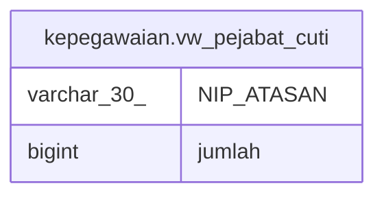

# kepegawaian.vw_pejabat_cuti

## Description

<details>
<summary><strong>Table Definition</strong></summary>

```sql
CREATE VIEW vw_pejabat_cuti AS (
 SELECT "NIP_ATASAN",
    count(*) AS jumlah
   FROM kepegawaian.line_approval_izin
  GROUP BY "NIP_ATASAN"
)
```

</details>

## Columns

| Name | Type | Default | Nullable | Children | Parents | Comment |
| ---- | ---- | ------- | -------- | -------- | ------- | ------- |
| NIP_ATASAN | varchar(30) |  | true |  |  |  |
| jumlah | bigint |  | true |  |  |  |

## Referenced Tables

| Name | Columns | Comment | Type |
| ---- | ------- | ------- | ---- |
| [kepegawaian.line_approval_izin](kepegawaian.line_approval_izin.md) | 7 |  | BASE TABLE |

## Relations



---

> Generated by [tbls](https://github.com/k1LoW/tbls)
