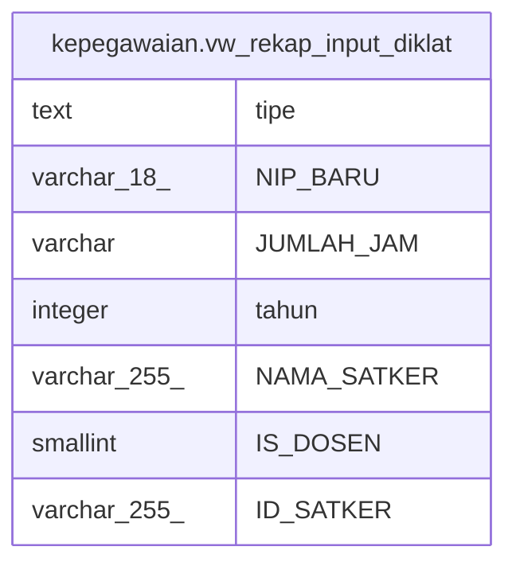

# kepegawaian.vw_rekap_input_diklat

## Description

<details>
<summary><strong>Table Definition</strong></summary>

```sql
CREATE VIEW vw_rekap_input_diklat AS (
 SELECT 'Diklat Fungsional'::text AS tipe,
    pegawai."NIP_BARU",
        CASE
            WHEN ((r_dik_fung."JUMLAH_JAM")::text = ''::text) THEN '0'::character varying
            ELSE r_dik_fung."JUMLAH_JAM"
        END AS "JUMLAH_JAM",
        CASE
            WHEN (split_part((r_dik_fung."TAHUN")::text, '-'::text, 1) ~ '^\d+$'::text) THEN (split_part((r_dik_fung."TAHUN")::text, '-'::text, 1))::integer
            ELSE 0
        END AS tahun,
    vw."NAMA_SATKER",
    pegawai."IS_DOSEN",
    vw."ID_SATKER"
   FROM ((kepegawaian.rwt_diklat_fungsional r_dik_fung
     JOIN kepegawaian.pegawai pegawai ON (((pegawai."NIP_BARU")::text = (r_dik_fung."NIP_BARU")::text)))
     JOIN kepegawaian.vw_unor_satker vw ON (((pegawai."UNOR_ID")::text = (vw."ID_UNOR")::text)))
UNION ALL
 SELECT 'Diklat Struktural'::text AS tipe,
    pegawai."NIP_BARU",
    '20'::character varying AS "JUMLAH_JAM",
    (r_dik_struk."TAHUN")::integer AS tahun,
    vw."NAMA_SATKER",
    pegawai."IS_DOSEN",
    vw."ID_SATKER"
   FROM ((kepegawaian.rwt_diklat_struktural r_dik_struk
     JOIN kepegawaian.pegawai pegawai ON (((pegawai."NIP_BARU")::text = (r_dik_struk."PNS_NIP")::text)))
     JOIN kepegawaian.vw_unor_satker vw ON (((pegawai."UNOR_ID")::text = (vw."ID_UNOR")::text)))
UNION ALL
 SELECT 'Riwayat Kursus'::text AS tipe,
    pegawai."NIP_BARU",
    (r_kurs."LAMA_KURSUS")::character varying AS "JUMLAH_JAM",
    (date_part('year'::text, r_kurs."TANGGAL_KURSUS"))::integer AS tahun,
    vw."NAMA_SATKER",
    pegawai."IS_DOSEN",
    vw."ID_SATKER"
   FROM ((kepegawaian.rwt_kursus r_kurs
     JOIN kepegawaian.pegawai pegawai ON (((pegawai."NIP_BARU")::bpchar = r_kurs."PNS_NIP")))
     JOIN kepegawaian.vw_unor_satker vw ON (((pegawai."UNOR_ID")::text = (vw."ID_UNOR")::text)))
UNION ALL
 SELECT jd.jenis_diklat AS tipe,
    (r_dik.nip_baru)::character varying(18) AS "NIP_BARU",
    (r_dik.durasi_jam)::character varying AS "JUMLAH_JAM",
    r_dik.tahun_diklat AS tahun,
    vw."NAMA_SATKER",
    pegawai."IS_DOSEN",
    vw."ID_SATKER"
   FROM (((kepegawaian.rwt_diklat r_dik
     JOIN kepegawaian.pegawai pegawai ON (((pegawai."NIP_BARU")::text = (r_dik.nip_baru)::text)))
     JOIN kepegawaian.vw_unor_satker vw ON (((pegawai."UNOR_ID")::text = (vw."ID_UNOR")::text)))
     JOIN kepegawaian.jenis_diklat jd ON (((r_dik.jenis_diklat_id)::integer = jd.id)))
)
```

</details>

## Columns

| Name | Type | Default | Nullable | Children | Parents | Comment |
| ---- | ---- | ------- | -------- | -------- | ------- | ------- |
| tipe | text |  | true |  |  |  |
| NIP_BARU | varchar(18) |  | true |  |  |  |
| JUMLAH_JAM | varchar |  | true |  |  |  |
| tahun | integer |  | true |  |  |  |
| NAMA_SATKER | varchar(255) |  | true |  |  |  |
| IS_DOSEN | smallint |  | true |  |  |  |
| ID_SATKER | varchar(255) |  | true |  |  |  |

## Referenced Tables

| Name | Columns | Comment | Type |
| ---- | ------- | ------- | ---- |
| [kepegawaian.rwt_diklat_fungsional](kepegawaian.rwt_diklat_fungsional.md) | 17 |  | BASE TABLE |
| [kepegawaian.pegawai](kepegawaian.pegawai.md) | 100 |  | BASE TABLE |
| [kepegawaian.vw_unor_satker](kepegawaian.vw_unor_satker.md) | 7 | Untuk Melihat Daftar Unit Kerja Berdasarkan Satkernya | VIEW |
| [kepegawaian.rwt_diklat_struktural](kepegawaian.rwt_diklat_struktural.md) | 15 |  | BASE TABLE |
| [kepegawaian.rwt_kursus](kepegawaian.rwt_kursus.md) | 16 |  | BASE TABLE |
| [kepegawaian.rwt_diklat](kepegawaian.rwt_diklat.md) | 19 |  | BASE TABLE |
| [kepegawaian.jenis_diklat](kepegawaian.jenis_diklat.md) | 5 |  | BASE TABLE |

## Relations



---

> Generated by [tbls](https://github.com/k1LoW/tbls)
