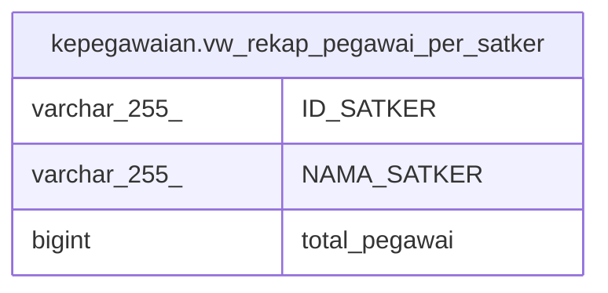

# kepegawaian.vw_rekap_pegawai_per_satker

## Description

rekap pegawai aktif per satker

<details>
<summary><strong>Table Definition</strong></summary>

```sql
CREATE VIEW vw_rekap_pegawai_per_satker AS (
 SELECT satker."ID_SATKER",
    satker."NAMA_SATKER",
    count(p."ID") AS total_pegawai
   FROM ((kepegawaian.vw_unor_satker satker
     LEFT JOIN kepegawaian.pegawai p ON (((satker."ID_UNOR")::text = (p."UNOR_ID")::text)))
     LEFT JOIN kepegawaian.pns_aktif pa ON ((pa."ID" = p."ID")))
  WHERE (pa."ID" IS NOT NULL)
  GROUP BY satker."ID_SATKER", satker."NAMA_SATKER"
  ORDER BY satker."NAMA_SATKER" DESC
)
```

</details>

## Columns

| Name | Type | Default | Nullable | Children | Parents | Comment |
| ---- | ---- | ------- | -------- | -------- | ------- | ------- |
| ID_SATKER | varchar(255) |  | true |  |  |  |
| NAMA_SATKER | varchar(255) |  | true |  |  |  |
| total_pegawai | bigint |  | true |  |  |  |

## Referenced Tables

| Name | Columns | Comment | Type |
| ---- | ------- | ------- | ---- |
| [kepegawaian.vw_unor_satker](kepegawaian.vw_unor_satker.md) | 7 | Untuk Melihat Daftar Unit Kerja Berdasarkan Satkernya | VIEW |
| [kepegawaian.pegawai](kepegawaian.pegawai.md) | 100 |  | BASE TABLE |
| [kepegawaian.pns_aktif](kepegawaian.pns_aktif.md) | 3 |  | VIEW |

## Relations



---

> Generated by [tbls](https://github.com/k1LoW/tbls)
