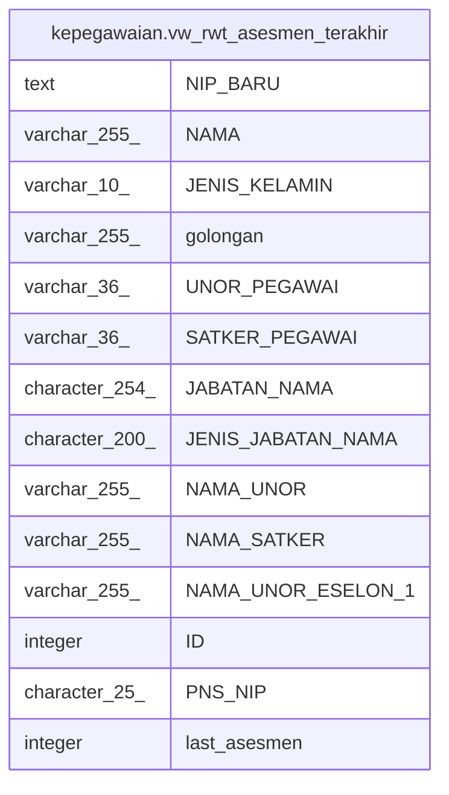

# kepegawaian.vw_rwt_asesmen_terakhir

## Description

<details>
<summary><strong>Table Definition</strong></summary>

```sql
CREATE VIEW vw_rwt_asesmen_terakhir AS (
 SELECT concat('|', pegawai."NIP_BARU") AS "NIP_BARU",
    pegawai."NAMA",
    pegawai."JENIS_KELAMIN",
    golongan."NAMA" AS golongan,
    pegawai."UNOR_ID" AS "UNOR_PEGAWAI",
    pegawai."SATUAN_KERJA_INDUK_ID" AS "SATKER_PEGAWAI",
    pegawai."JABATAN_NAMA",
    pegawai."JENIS_JABATAN_NAMA",
    vw_unor_satker."NAMA_UNOR",
    vw_unor_satker."NAMA_SATKER",
    vw_unor_satker."NAMA_UNOR_ESELON_1",
    rwt_assesmen."ID",
    rwt_assesmen."PNS_NIP",
    max((rwt_assesmen."TAHUN")::integer) AS last_asesmen
   FROM ((((kepegawaian.pegawai pegawai
     LEFT JOIN kepegawaian.golongan ON ((pegawai."GOL_ID" = golongan."ID")))
     LEFT JOIN kepegawaian.rwt_assesmen ON (((pegawai."NIP_BARU")::bpchar = rwt_assesmen."PNS_NIP")))
     LEFT JOIN kepegawaian.vw_unor_satker ON (((pegawai."UNOR_ID")::text = (vw_unor_satker."ID_UNOR")::text)))
     LEFT JOIN kepegawaian.pns_aktif pa ON ((pegawai."ID" = pa."ID")))
  WHERE ((pegawai.status_pegawai = 1) AND ((pegawai.terminated_date IS NULL) OR ((pegawai.terminated_date IS NOT NULL) AND (pegawai.terminated_date > ('now'::text)::date))) AND (pa."ID" IS NOT NULL) AND ((pegawai."KEDUDUKAN_HUKUM_ID")::text <> '99'::text) AND ((pegawai."KEDUDUKAN_HUKUM_ID")::text <> '66'::text) AND ((pegawai."KEDUDUKAN_HUKUM_ID")::text <> '52'::text) AND ((pegawai."KEDUDUKAN_HUKUM_ID")::text <> '20'::text) AND ((pegawai."KEDUDUKAN_HUKUM_ID")::text <> '04'::text) AND ((pegawai.status_pegawai <> 3) OR (pegawai.status_pegawai IS NULL)))
  GROUP BY pegawai."NIP_BARU", pegawai."NAMA", pegawai."JENIS_KELAMIN", golongan."NAMA", pegawai."UNOR_ID", pegawai."SATUAN_KERJA_INDUK_ID", pegawai."JABATAN_NAMA", pegawai."JENIS_JABATAN_NAMA", vw_unor_satker."NAMA_UNOR", vw_unor_satker."NAMA_SATKER", vw_unor_satker."NAMA_UNOR_ESELON_1", rwt_assesmen."ID", rwt_assesmen."PNS_ID", rwt_assesmen."PNS_NIP"
)
```

</details>

## Columns

| Name | Type | Default | Nullable | Children | Parents | Comment |
| ---- | ---- | ------- | -------- | -------- | ------- | ------- |
| NIP_BARU | text |  | true |  |  |  |
| NAMA | varchar(255) |  | true |  |  |  |
| JENIS_KELAMIN | varchar(10) |  | true |  |  |  |
| golongan | varchar(255) |  | true |  |  |  |
| UNOR_PEGAWAI | varchar(36) |  | true |  |  |  |
| SATKER_PEGAWAI | varchar(36) |  | true |  |  |  |
| JABATAN_NAMA | character(254) |  | true |  |  |  |
| JENIS_JABATAN_NAMA | character(200) |  | true |  |  |  |
| NAMA_UNOR | varchar(255) |  | true |  |  |  |
| NAMA_SATKER | varchar(255) |  | true |  |  |  |
| NAMA_UNOR_ESELON_1 | varchar(255) |  | true |  |  |  |
| ID | integer |  | true |  |  |  |
| PNS_NIP | character(25) |  | true |  |  |  |
| last_asesmen | integer |  | true |  |  |  |

## Referenced Tables

| Name | Columns | Comment | Type |
| ---- | ------- | ------- | ---- |
| [kepegawaian.pegawai](kepegawaian.pegawai.md) | 100 |  | BASE TABLE |
| [kepegawaian.golongan](kepegawaian.golongan.md) | 6 |  | BASE TABLE |
| [kepegawaian.rwt_assesmen](kepegawaian.rwt_assesmen.md) | 19 |  | BASE TABLE |
| [kepegawaian.vw_unor_satker](kepegawaian.vw_unor_satker.md) | 7 | Untuk Melihat Daftar Unit Kerja Berdasarkan Satkernya | VIEW |
| [kepegawaian.pns_aktif](kepegawaian.pns_aktif.md) | 3 |  | VIEW |

## Relations



---

> Generated by [tbls](https://github.com/k1LoW/tbls)
