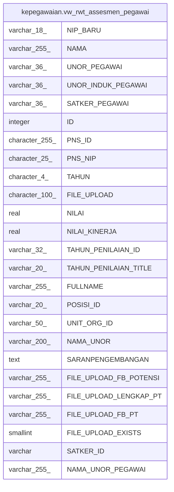

# kepegawaian.vw_rwt_assesmen_pegawai

## Description

<details>
<summary><strong>Table Definition</strong></summary>

```sql
CREATE VIEW vw_rwt_assesmen_pegawai AS (
 SELECT pegawai."NIP_BARU",
    pegawai."NAMA",
    pegawai."UNOR_ID" AS "UNOR_PEGAWAI",
    pegawai."UNOR_INDUK_ID" AS "UNOR_INDUK_PEGAWAI",
    pegawai."SATUAN_KERJA_INDUK_ID" AS "SATKER_PEGAWAI",
    rwt_assesmen."ID",
    rwt_assesmen."PNS_ID",
    rwt_assesmen."PNS_NIP",
    rwt_assesmen."TAHUN",
    rwt_assesmen."FILE_UPLOAD",
    rwt_assesmen."NILAI",
    rwt_assesmen."NILAI_KINERJA",
    rwt_assesmen."TAHUN_PENILAIAN_ID",
    rwt_assesmen."TAHUN_PENILAIAN_TITLE",
    rwt_assesmen."FULLNAME",
    rwt_assesmen."POSISI_ID",
    rwt_assesmen."UNIT_ORG_ID",
    rwt_assesmen."NAMA_UNOR",
    rwt_assesmen."SARANPENGEMBANGAN",
    rwt_assesmen."FILE_UPLOAD_FB_POTENSI",
    rwt_assesmen."FILE_UPLOAD_LENGKAP_PT",
    rwt_assesmen."FILE_UPLOAD_FB_PT",
    rwt_assesmen."FILE_UPLOAD_EXISTS",
    rwt_assesmen."SATKER_ID",
    vw_unor_satker."NAMA_UNOR" AS "NAMA_UNOR_PEGAWAI"
   FROM ((kepegawaian.pegawai pegawai
     LEFT JOIN kepegawaian.rwt_assesmen ON (((pegawai."NIP_BARU")::bpchar = rwt_assesmen."PNS_NIP")))
     LEFT JOIN kepegawaian.vw_unor_satker ON (((pegawai."UNOR_ID")::text = (vw_unor_satker."ID_UNOR")::text)))
  WHERE ((rwt_assesmen."ID" IS NOT NULL) AND (pegawai.status_pegawai = 1) AND ((pegawai.terminated_date IS NULL) OR ((pegawai.terminated_date IS NOT NULL) AND (pegawai.terminated_date > ('now'::text)::date))))
)
```

</details>

## Columns

| Name | Type | Default | Nullable | Children | Parents | Comment |
| ---- | ---- | ------- | -------- | -------- | ------- | ------- |
| NIP_BARU | varchar(18) |  | true |  |  |  |
| NAMA | varchar(255) |  | true |  |  |  |
| UNOR_PEGAWAI | varchar(36) |  | true |  |  |  |
| UNOR_INDUK_PEGAWAI | varchar(36) |  | true |  |  |  |
| SATKER_PEGAWAI | varchar(36) |  | true |  |  |  |
| ID | integer |  | true |  |  |  |
| PNS_ID | character(255) |  | true |  |  |  |
| PNS_NIP | character(25) |  | true |  |  |  |
| TAHUN | character(4) |  | true |  |  |  |
| FILE_UPLOAD | character(100) |  | true |  |  |  |
| NILAI | real |  | true |  |  |  |
| NILAI_KINERJA | real |  | true |  |  |  |
| TAHUN_PENILAIAN_ID | varchar(32) |  | true |  |  |  |
| TAHUN_PENILAIAN_TITLE | varchar(20) |  | true |  |  |  |
| FULLNAME | varchar(255) |  | true |  |  |  |
| POSISI_ID | varchar(20) |  | true |  |  |  |
| UNIT_ORG_ID | varchar(50) |  | true |  |  |  |
| NAMA_UNOR | varchar(200) |  | true |  |  |  |
| SARANPENGEMBANGAN | text |  | true |  |  |  |
| FILE_UPLOAD_FB_POTENSI | varchar(255) |  | true |  |  |  |
| FILE_UPLOAD_LENGKAP_PT | varchar(255) |  | true |  |  |  |
| FILE_UPLOAD_FB_PT | varchar(255) |  | true |  |  |  |
| FILE_UPLOAD_EXISTS | smallint |  | true |  |  |  |
| SATKER_ID | varchar |  | true |  |  |  |
| NAMA_UNOR_PEGAWAI | varchar(255) |  | true |  |  |  |

## Referenced Tables

| Name | Columns | Comment | Type |
| ---- | ------- | ------- | ---- |
| [kepegawaian.pegawai](kepegawaian.pegawai.md) | 100 |  | BASE TABLE |
| [kepegawaian.rwt_assesmen](kepegawaian.rwt_assesmen.md) | 19 |  | BASE TABLE |
| [kepegawaian.vw_unor_satker](kepegawaian.vw_unor_satker.md) | 7 | Untuk Melihat Daftar Unit Kerja Berdasarkan Satkernya | VIEW |

## Relations



---

> Generated by [tbls](https://github.com/k1LoW/tbls)
