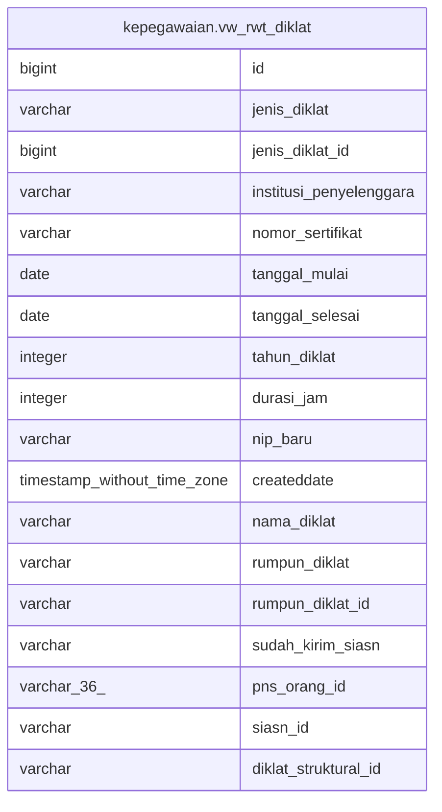

# kepegawaian.vw_rwt_diklat

## Description

<details>
<summary><strong>Table Definition</strong></summary>

```sql
CREATE VIEW vw_rwt_diklat AS (
 SELECT rwt_diklat.id,
    jenis_diklat_siasn.jenis_diklat,
    jenis_diklat_siasn.id AS jenis_diklat_id,
    rwt_diklat.institusi_penyelenggara,
    rwt_diklat.nomor_sertifikat,
    rwt_diklat.tanggal_mulai,
    rwt_diklat.tanggal_selesai,
    rwt_diklat.tahun_diklat,
    rwt_diklat.durasi_jam,
    rwt_diklat.nip_baru,
    rwt_diklat.createddate,
    rwt_diklat.nama_diklat,
    jenis_rumpun_diklat_siasn.nama AS rumpun_diklat,
    jenis_rumpun_diklat_siasn.id AS rumpun_diklat_id,
    rwt_diklat.sudah_kirim_siasn,
    pegawai."PNS_ID" AS pns_orang_id,
    rwt_diklat.siasn_id,
    rwt_diklat.diklat_struktural_id
   FROM (((kepegawaian.rwt_diklat
     LEFT JOIN kepegawaian.jenis_diklat_siasn ON (((rwt_diklat.jenis_diklat_id)::text = (jenis_diklat_siasn.id)::text)))
     LEFT JOIN kepegawaian.jenis_rumpun_diklat_siasn ON (((jenis_rumpun_diklat_siasn.id)::text = (rwt_diklat.rumpun_diklat_id)::text)))
     LEFT JOIN kepegawaian.pegawai ON (((pegawai."NIP_BARU")::text = (rwt_diklat.nip_baru)::text)))
)
```

</details>

## Columns

| Name | Type | Default | Nullable | Children | Parents | Comment |
| ---- | ---- | ------- | -------- | -------- | ------- | ------- |
| id | bigint |  | true |  |  |  |
| jenis_diklat | varchar |  | true |  |  |  |
| jenis_diklat_id | bigint |  | true |  |  |  |
| institusi_penyelenggara | varchar |  | true |  |  |  |
| nomor_sertifikat | varchar |  | true |  |  |  |
| tanggal_mulai | date |  | true |  |  |  |
| tanggal_selesai | date |  | true |  |  |  |
| tahun_diklat | integer |  | true |  |  |  |
| durasi_jam | integer |  | true |  |  |  |
| nip_baru | varchar |  | true |  |  |  |
| createddate | timestamp without time zone |  | true |  |  |  |
| nama_diklat | varchar |  | true |  |  |  |
| rumpun_diklat | varchar |  | true |  |  |  |
| rumpun_diklat_id | varchar |  | true |  |  |  |
| sudah_kirim_siasn | varchar |  | true |  |  |  |
| pns_orang_id | varchar(36) |  | true |  |  |  |
| siasn_id | varchar |  | true |  |  |  |
| diklat_struktural_id | varchar |  | true |  |  |  |

## Referenced Tables

| Name | Columns | Comment | Type |
| ---- | ------- | ------- | ---- |
| [kepegawaian.rwt_diklat](kepegawaian.rwt_diklat.md) | 19 |  | BASE TABLE |
| [kepegawaian.jenis_diklat_siasn](kepegawaian.jenis_diklat_siasn.md) | 2 |  | BASE TABLE |
| [kepegawaian.jenis_rumpun_diklat_siasn](kepegawaian.jenis_rumpun_diklat_siasn.md) | 6 |  | BASE TABLE |
| [kepegawaian.pegawai](kepegawaian.pegawai.md) | 100 |  | BASE TABLE |

## Relations



---

> Generated by [tbls](https://github.com/k1LoW/tbls)
