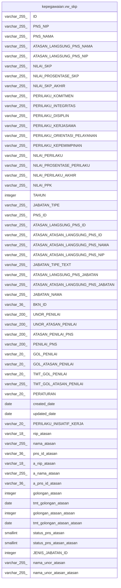

# kepegawaian.vw_skp

## Description

<details>
<summary><strong>Table Definition</strong></summary>

```sql
CREATE VIEW vw_skp AS (
 SELECT s."ID",
    s."PNS_NIP",
    s."PNS_NAMA",
    s."ATASAN_LANGSUNG_PNS_NAMA",
    s."ATASAN_LANGSUNG_PNS_NIP",
    s."NILAI_SKP",
    s."NILAI_PROSENTASE_SKP",
    s."NILAI_SKP_AKHIR",
    s."PERILAKU_KOMITMEN",
    s."PERILAKU_INTEGRITAS",
    s."PERILAKU_DISIPLIN",
    s."PERILAKU_KERJASAMA",
    s."PERILAKU_ORIENTASI_PELAYANAN",
    s."PERILAKU_KEPEMIMPINAN",
    s."NILAI_PERILAKU",
    s."NILAI_PROSENTASE_PERILAKU",
    s."NILAI_PERILAKU_AKHIR",
    s."NILAI_PPK",
    s."TAHUN",
    s."JABATAN_TIPE",
    s."PNS_ID",
    s."ATASAN_LANGSUNG_PNS_ID",
    s."ATASAN_ATASAN_LANGSUNG_PNS_ID",
    s."ATASAN_ATASAN_LANGSUNG_PNS_NAMA",
    s."ATASAN_ATASAN_LANGSUNG_PNS_NIP",
    s."JABATAN_TIPE_TEXT",
    s."ATASAN_LANGSUNG_PNS_JABATAN",
    s."ATASAN_ATASAN_LANGSUNG_PNS_JABATAN",
    s."JABATAN_NAMA",
    s."BKN_ID",
    s."UNOR_PENILAI",
    s."UNOR_ATASAN_PENILAI",
    s."ATASAN_PENILAI_PNS",
    s."PENILAI_PNS",
    s."GOL_PENILAI",
    s."GOL_ATASAN_PENILAI",
    s."TMT_GOL_PENILAI",
    s."TMT_GOL_ATASAN_PENILAI",
    s."PERATURAN",
    s.created_date,
    s.updated_date,
    s."PERILAKU_INISIATIF_KERJA",
    a."NIP_BARU" AS nip_atasan,
    a."NAMA" AS nama_atasan,
    a."PNS_ID" AS pns_id_atasan,
    aa."NIP_BARU" AS a_nip_atasan,
    aa."NAMA" AS a_nama_atasan,
    aa."PNS_ID" AS a_pns_id_atasan,
    ag."ID" AS golongan_atasan,
    a."TMT_GOLONGAN" AS tmt_golongan_atasan,
    aag."ID" AS golongan_atasan_atasan,
    aa."TMT_GOLONGAN" AS tmt_golongan_atasan_atasan,
    a.status_pegawai AS status_pns_atasan,
    aa.status_pegawai AS status_pns_atasan_atasan,
    p."JENIS_JABATAN_ID",
    au."NAMA_UNOR" AS nama_unor_atasan,
    aau."NAMA_UNOR" AS nama_unor_atasan_atasan
   FROM (((((((kepegawaian.rwt_prestasi_kerja s
     LEFT JOIN kepegawaian.pegawai p ON (((s."PNS_NIP")::text = (p."NIP_BARU")::text)))
     LEFT JOIN kepegawaian.pegawai a ON (((s."ATASAN_LANGSUNG_PNS_NIP")::text = (a."NIP_BARU")::text)))
     LEFT JOIN kepegawaian.pegawai aa ON (((s."ATASAN_ATASAN_LANGSUNG_PNS_NIP")::text = (aa."NIP_BARU")::text)))
     LEFT JOIN kepegawaian.golongan ag ON (((a."GOL_ID")::text = (ag."ID")::text)))
     LEFT JOIN kepegawaian.golongan aag ON (((aa."GOL_ID")::text = (aag."ID")::text)))
     LEFT JOIN kepegawaian.vw_unit_list au ON (((a."UNOR_ID")::text = (au."ID")::text)))
     LEFT JOIN kepegawaian.vw_unit_list aau ON (((aa."UNOR_ID")::text = (aau."ID")::text)))
)
```

</details>

## Columns

| Name | Type | Default | Nullable | Children | Parents | Comment |
| ---- | ---- | ------- | -------- | -------- | ------- | ------- |
| ID | varchar(255) |  | true |  |  |  |
| PNS_NIP | varchar(255) |  | true |  |  |  |
| PNS_NAMA | varchar(255) |  | true |  |  |  |
| ATASAN_LANGSUNG_PNS_NAMA | varchar(255) |  | true |  |  |  |
| ATASAN_LANGSUNG_PNS_NIP | varchar(255) |  | true |  |  |  |
| NILAI_SKP | varchar(255) |  | true |  |  |  |
| NILAI_PROSENTASE_SKP | varchar(255) |  | true |  |  |  |
| NILAI_SKP_AKHIR | varchar(255) |  | true |  |  |  |
| PERILAKU_KOMITMEN | varchar(255) |  | true |  |  |  |
| PERILAKU_INTEGRITAS | varchar(255) |  | true |  |  |  |
| PERILAKU_DISIPLIN | varchar(255) |  | true |  |  |  |
| PERILAKU_KERJASAMA | varchar(255) |  | true |  |  |  |
| PERILAKU_ORIENTASI_PELAYANAN | varchar(255) |  | true |  |  |  |
| PERILAKU_KEPEMIMPINAN | varchar(255) |  | true |  |  |  |
| NILAI_PERILAKU | varchar(255) |  | true |  |  |  |
| NILAI_PROSENTASE_PERILAKU | varchar(255) |  | true |  |  |  |
| NILAI_PERILAKU_AKHIR | varchar(255) |  | true |  |  |  |
| NILAI_PPK | varchar(255) |  | true |  |  |  |
| TAHUN | integer |  | true |  |  |  |
| JABATAN_TIPE | varchar(255) |  | true |  |  |  |
| PNS_ID | varchar(255) |  | true |  |  |  |
| ATASAN_LANGSUNG_PNS_ID | varchar(255) |  | true |  |  |  |
| ATASAN_ATASAN_LANGSUNG_PNS_ID | varchar(255) |  | true |  |  |  |
| ATASAN_ATASAN_LANGSUNG_PNS_NAMA | varchar(255) |  | true |  |  |  |
| ATASAN_ATASAN_LANGSUNG_PNS_NIP | varchar(255) |  | true |  |  |  |
| JABATAN_TIPE_TEXT | varchar(255) |  | true |  |  |  |
| ATASAN_LANGSUNG_PNS_JABATAN | varchar(255) |  | true |  |  |  |
| ATASAN_ATASAN_LANGSUNG_PNS_JABATAN | varchar(255) |  | true |  |  |  |
| JABATAN_NAMA | varchar(255) |  | true |  |  |  |
| BKN_ID | varchar(36) |  | true |  |  |  |
| UNOR_PENILAI | varchar(200) |  | true |  |  |  |
| UNOR_ATASAN_PENILAI | varchar(200) |  | true |  |  |  |
| ATASAN_PENILAI_PNS | varchar(200) |  | true |  |  |  |
| PENILAI_PNS | varchar(200) |  | true |  |  |  |
| GOL_PENILAI | varchar(20) |  | true |  |  |  |
| GOL_ATASAN_PENILAI | varchar(20) |  | true |  |  |  |
| TMT_GOL_PENILAI | varchar(20) |  | true |  |  |  |
| TMT_GOL_ATASAN_PENILAI | varchar(255) |  | true |  |  |  |
| PERATURAN | varchar(20) |  | true |  |  |  |
| created_date | date |  | true |  |  |  |
| updated_date | date |  | true |  |  |  |
| PERILAKU_INISIATIF_KERJA | varchar(20) |  | true |  |  |  |
| nip_atasan | varchar(18) |  | true |  |  |  |
| nama_atasan | varchar(255) |  | true |  |  |  |
| pns_id_atasan | varchar(36) |  | true |  |  |  |
| a_nip_atasan | varchar(18) |  | true |  |  |  |
| a_nama_atasan | varchar(255) |  | true |  |  |  |
| a_pns_id_atasan | varchar(36) |  | true |  |  |  |
| golongan_atasan | integer |  | true |  |  |  |
| tmt_golongan_atasan | date |  | true |  |  |  |
| golongan_atasan_atasan | integer |  | true |  |  |  |
| tmt_golongan_atasan_atasan | date |  | true |  |  |  |
| status_pns_atasan | smallint |  | true |  |  |  |
| status_pns_atasan_atasan | smallint |  | true |  |  |  |
| JENIS_JABATAN_ID | integer |  | true |  |  |  |
| nama_unor_atasan | varchar(255) |  | true |  |  |  |
| nama_unor_atasan_atasan | varchar(255) |  | true |  |  |  |

## Referenced Tables

| Name | Columns | Comment | Type |
| ---- | ------- | ------- | ---- |
| [kepegawaian.rwt_prestasi_kerja](kepegawaian.rwt_prestasi_kerja.md) | 42 |  | BASE TABLE |
| [kepegawaian.pegawai](kepegawaian.pegawai.md) | 100 |  | BASE TABLE |
| [kepegawaian.golongan](kepegawaian.golongan.md) | 6 |  | BASE TABLE |
| [kepegawaian.vw_unit_list](kepegawaian.vw_unit_list.md) | 30 |  | MATERIALIZED VIEW |

## Relations



---

> Generated by [tbls](https://github.com/k1LoW/tbls)
