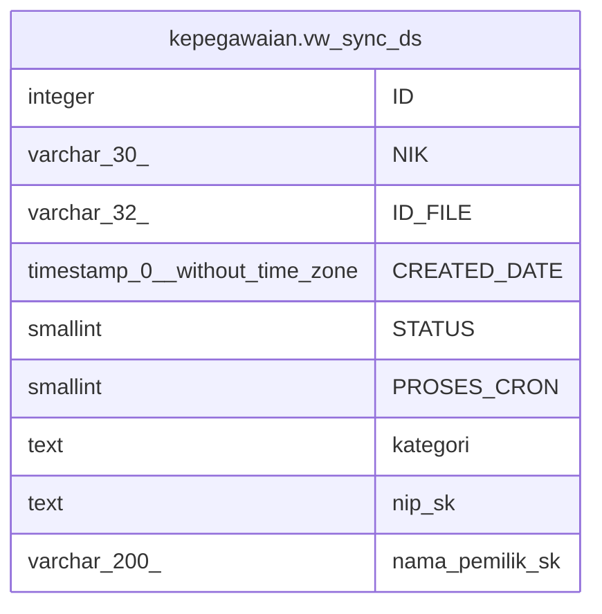

# kepegawaian.vw_sync_ds

## Description

<details>
<summary><strong>Table Definition</strong></summary>

```sql
CREATE VIEW vw_sync_ds AS (
 SELECT ld."ID",
    ld."NIK",
    ld."ID_FILE",
    ld."CREATED_DATE",
    ld."STATUS",
    ld."PROSES_CRON",
    btrim((ds.kategori)::text) AS kategori,
    btrim((ds.nip_sk)::text) AS nip_sk,
    ds.nama_pemilik_sk
   FROM (kepegawaian.log_ds ld
     LEFT JOIN kepegawaian.tbl_file_ds ds ON (((ld."ID_FILE")::text = (ds.id_file)::text)))
  WHERE ((ld."STATUS" = 2) AND (ds.nip_sk IS NOT NULL) AND (ds.telah_kirim = 1) AND (ds.ds_ok = 1) AND (ld."PROSES_CRON" = 0) AND (ds.is_signed = 1))
)
```

</details>

## Columns

| Name | Type | Default | Nullable | Children | Parents | Comment |
| ---- | ---- | ------- | -------- | -------- | ------- | ------- |
| ID | integer |  | true |  |  |  |
| NIK | varchar(30) |  | true |  |  |  |
| ID_FILE | varchar(32) |  | true |  |  |  |
| CREATED_DATE | timestamp(0) without time zone |  | true |  |  |  |
| STATUS | smallint |  | true |  |  |  |
| PROSES_CRON | smallint |  | true |  |  |  |
| kategori | text |  | true |  |  |  |
| nip_sk | text |  | true |  |  |  |
| nama_pemilik_sk | varchar(200) |  | true |  |  |  |

## Referenced Tables

| Name | Columns | Comment | Type |
| ---- | ------- | ------- | ---- |
| [kepegawaian.log_ds](kepegawaian.log_ds.md) | 8 |  | BASE TABLE |
| [kepegawaian.tbl_file_ds](kepegawaian.tbl_file_ds.md) | 39 |  | BASE TABLE |

## Relations



---

> Generated by [tbls](https://github.com/k1LoW/tbls)
