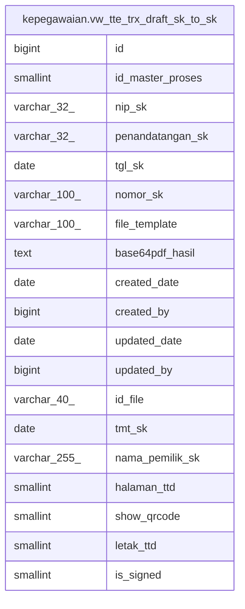

# kepegawaian.vw_tte_trx_draft_sk_to_sk

## Description

<details>
<summary><strong>Table Definition</strong></summary>

```sql
CREATE VIEW vw_tte_trx_draft_sk_to_sk AS (
 SELECT ttdsk.id,
    ttdsk.id_master_proses,
    ttdsk.nip_sk,
    ttdsk.penandatangan_sk,
    ttdsk.tgl_sk,
    ttdsk.nomor_sk,
    ttdsk.file_template,
    ttdsk.base64pdf_hasil,
    ttdsk.created_date,
    ttdsk.created_by,
    ttdsk.updated_date,
    ttdsk.updated_by,
    ttdsk.id_file,
    ttdsk.tmt_sk,
    ttdsk.nama_pemilik_sk,
    ttdsk.halaman_ttd,
    ttdsk.show_qrcode,
    ttdsk.letak_ttd,
    tfd.is_signed
   FROM (kepegawaian.tte_trx_draft_sk ttdsk
     JOIN kepegawaian.tbl_file_ds tfd ON (((ttdsk.id_file)::text = (tfd.id_file)::text)))
)
```

</details>

## Columns

| Name | Type | Default | Nullable | Children | Parents | Comment |
| ---- | ---- | ------- | -------- | -------- | ------- | ------- |
| id | bigint |  | true |  |  |  |
| id_master_proses | smallint |  | true |  |  |  |
| nip_sk | varchar(32) |  | true |  |  |  |
| penandatangan_sk | varchar(32) |  | true |  |  |  |
| tgl_sk | date |  | true |  |  |  |
| nomor_sk | varchar(100) |  | true |  |  |  |
| file_template | varchar(100) |  | true |  |  |  |
| base64pdf_hasil | text |  | true |  |  |  |
| created_date | date |  | true |  |  |  |
| created_by | bigint |  | true |  |  |  |
| updated_date | date |  | true |  |  |  |
| updated_by | bigint |  | true |  |  |  |
| id_file | varchar(40) |  | true |  |  |  |
| tmt_sk | date |  | true |  |  |  |
| nama_pemilik_sk | varchar(255) |  | true |  |  |  |
| halaman_ttd | smallint |  | true |  |  |  |
| show_qrcode | smallint |  | true |  |  |  |
| letak_ttd | smallint |  | true |  |  |  |
| is_signed | smallint |  | true |  |  |  |

## Referenced Tables

| Name | Columns | Comment | Type |
| ---- | ------- | ------- | ---- |
| [kepegawaian.tte_trx_draft_sk](kepegawaian.tte_trx_draft_sk.md) | 18 |  | BASE TABLE |
| [kepegawaian.tbl_file_ds](kepegawaian.tbl_file_ds.md) | 39 |  | BASE TABLE |

## Relations



---

> Generated by [tbls](https://github.com/k1LoW/tbls)
