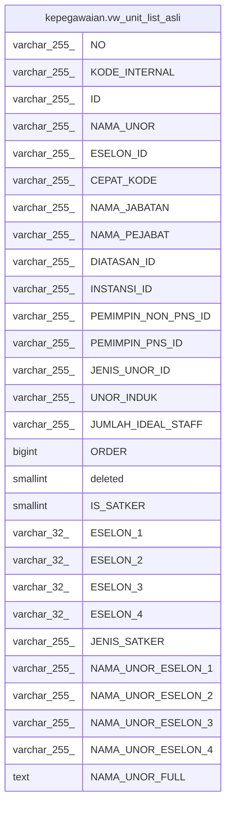

# kepegawaian.vw_unit_list_asli

## Description

<details>
<summary><strong>Table Definition</strong></summary>

```sql
CREATE VIEW vw_unit_list_asli AS (
 SELECT uk."NO",
    uk."KODE_INTERNAL",
    uk."ID",
    uk."NAMA_UNOR",
    uk."ESELON_ID",
    uk."CEPAT_KODE",
    uk."NAMA_JABATAN",
    uk."NAMA_PEJABAT",
    uk."DIATASAN_ID",
    uk."INSTANSI_ID",
    uk."PEMIMPIN_NON_PNS_ID",
    uk."PEMIMPIN_PNS_ID",
    uk."JENIS_UNOR_ID",
    uk."UNOR_INDUK",
    uk."JUMLAH_IDEAL_STAFF",
    uk."ORDER",
    uk.deleted,
    uk."IS_SATKER",
    uk."ESELON_1",
    uk."ESELON_2",
    uk."ESELON_3",
    uk."ESELON_4",
    uk."JENIS_SATKER",
    es1."NAMA_UNOR" AS "NAMA_UNOR_ESELON_1",
    es2."NAMA_UNOR" AS "NAMA_UNOR_ESELON_2",
    es3."NAMA_UNOR" AS "NAMA_UNOR_ESELON_3",
    es4."NAMA_UNOR" AS "NAMA_UNOR_ESELON_4",
    btrim(concat(es1."NAMA_UNOR", '-', es2."NAMA_UNOR", '-', es3."NAMA_UNOR", '-', es4."NAMA_UNOR"), '-'::text) AS "NAMA_UNOR_FULL"
   FROM ((((kepegawaian.unitkerja uk
     LEFT JOIN kepegawaian.unitkerja es1 ON (((es1."ID")::text = (uk."ESELON_1")::text)))
     LEFT JOIN kepegawaian.unitkerja es2 ON (((es2."ID")::text = (uk."ESELON_2")::text)))
     LEFT JOIN kepegawaian.unitkerja es3 ON (((es3."ID")::text = (uk."ESELON_3")::text)))
     LEFT JOIN kepegawaian.unitkerja es4 ON (((es4."ID")::text = (uk."ESELON_4")::text)))
)
```

</details>

## Columns

| Name | Type | Default | Nullable | Children | Parents | Comment |
| ---- | ---- | ------- | -------- | -------- | ------- | ------- |
| NO | varchar(255) |  | true |  |  |  |
| KODE_INTERNAL | varchar(255) |  | true |  |  |  |
| ID | varchar(255) |  | true |  |  |  |
| NAMA_UNOR | varchar(255) |  | true |  |  |  |
| ESELON_ID | varchar(255) |  | true |  |  |  |
| CEPAT_KODE | varchar(255) |  | true |  |  |  |
| NAMA_JABATAN | varchar(255) |  | true |  |  |  |
| NAMA_PEJABAT | varchar(255) |  | true |  |  |  |
| DIATASAN_ID | varchar(255) |  | true |  |  |  |
| INSTANSI_ID | varchar(255) |  | true |  |  |  |
| PEMIMPIN_NON_PNS_ID | varchar(255) |  | true |  |  |  |
| PEMIMPIN_PNS_ID | varchar(255) |  | true |  |  |  |
| JENIS_UNOR_ID | varchar(255) |  | true |  |  |  |
| UNOR_INDUK | varchar(255) |  | true |  |  |  |
| JUMLAH_IDEAL_STAFF | varchar(255) |  | true |  |  |  |
| ORDER | bigint |  | true |  |  |  |
| deleted | smallint |  | true |  |  |  |
| IS_SATKER | smallint |  | true |  |  |  |
| ESELON_1 | varchar(32) |  | true |  |  |  |
| ESELON_2 | varchar(32) |  | true |  |  |  |
| ESELON_3 | varchar(32) |  | true |  |  |  |
| ESELON_4 | varchar(32) |  | true |  |  |  |
| JENIS_SATKER | varchar(255) |  | true |  |  |  |
| NAMA_UNOR_ESELON_1 | varchar(255) |  | true |  |  |  |
| NAMA_UNOR_ESELON_2 | varchar(255) |  | true |  |  |  |
| NAMA_UNOR_ESELON_3 | varchar(255) |  | true |  |  |  |
| NAMA_UNOR_ESELON_4 | varchar(255) |  | true |  |  |  |
| NAMA_UNOR_FULL | text |  | true |  |  |  |

## Referenced Tables

| Name | Columns | Comment | Type |
| ---- | ------- | ------- | ---- |
| [kepegawaian.unitkerja](kepegawaian.unitkerja.md) | 30 |  | BASE TABLE |

## Relations



---

> Generated by [tbls](https://github.com/k1LoW/tbls)
