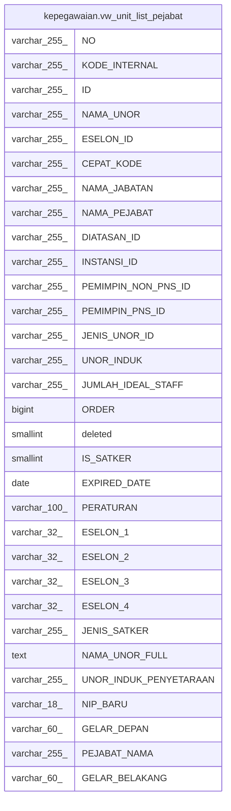

# kepegawaian.vw_unit_list_pejabat

## Description

<details>
<summary><strong>Table Definition</strong></summary>

```sql
CREATE VIEW vw_unit_list_pejabat AS (
 SELECT uk."NO",
    uk."KODE_INTERNAL",
    uk."ID",
    uk."NAMA_UNOR",
    uk."ESELON_ID",
    uk."CEPAT_KODE",
    uk."NAMA_JABATAN",
    uk."NAMA_PEJABAT",
    uk."DIATASAN_ID",
    uk."INSTANSI_ID",
    uk."PEMIMPIN_NON_PNS_ID",
    uk."PEMIMPIN_PNS_ID",
    uk."JENIS_UNOR_ID",
    uk."UNOR_INDUK",
    uk."JUMLAH_IDEAL_STAFF",
    uk."ORDER",
    uk.deleted,
    uk."IS_SATKER",
    uk."EXPIRED_DATE",
    uk."PERATURAN",
    (x.eselon[1])::character varying(32) AS "ESELON_1",
    (x.eselon[2])::character varying(32) AS "ESELON_2",
    (x.eselon[3])::character varying(32) AS "ESELON_3",
    (x.eselon[4])::character varying(32) AS "ESELON_4",
    uk."JENIS_SATKER",
    x."NAMA_UNOR" AS "NAMA_UNOR_FULL",
    uk."UNOR_INDUK_PENYETARAAN",
    p."NIP_BARU",
    p."GELAR_DEPAN",
    p."NAMA" AS "PEJABAT_NAMA",
    p."GELAR_BELAKANG"
   FROM ((kepegawaian.unitkerja uk
     LEFT JOIN kepegawaian.pegawai p ON (((p."PNS_ID")::text = (uk."PEMIMPIN_PNS_ID")::text)))
     LEFT JOIN ( WITH RECURSIVE r AS (
                 SELECT unitkerja."ID",
                    (unitkerja."NAMA_UNOR")::text AS "NAMA_UNOR",
                    (unitkerja."ID")::text AS arr_id
                   FROM kepegawaian.unitkerja
                  WHERE ((unitkerja."DIATASAN_ID")::text = 'A8ACA7397AEB3912E040640A040269BB'::text)
                UNION ALL
                 SELECT a."ID",
                    (((a."NAMA_UNOR")::text || ' - '::text) || r_1."NAMA_UNOR"),
                    ((r_1.arr_id || '#'::text) || (a."ID")::text)
                   FROM (kepegawaian.unitkerja a
                     JOIN r r_1 ON (((r_1."ID")::text = (a."DIATASAN_ID")::text)))
                )
         SELECT r."ID",
            r."NAMA_UNOR",
            string_to_array(r.arr_id, '#'::text) AS eselon
           FROM r) x ON (((uk."ID")::text = (x."ID")::text)))
)
```

</details>

## Columns

| Name | Type | Default | Nullable | Children | Parents | Comment |
| ---- | ---- | ------- | -------- | -------- | ------- | ------- |
| NO | varchar(255) |  | true |  |  |  |
| KODE_INTERNAL | varchar(255) |  | true |  |  |  |
| ID | varchar(255) |  | true |  |  |  |
| NAMA_UNOR | varchar(255) |  | true |  |  |  |
| ESELON_ID | varchar(255) |  | true |  |  |  |
| CEPAT_KODE | varchar(255) |  | true |  |  |  |
| NAMA_JABATAN | varchar(255) |  | true |  |  |  |
| NAMA_PEJABAT | varchar(255) |  | true |  |  |  |
| DIATASAN_ID | varchar(255) |  | true |  |  |  |
| INSTANSI_ID | varchar(255) |  | true |  |  |  |
| PEMIMPIN_NON_PNS_ID | varchar(255) |  | true |  |  |  |
| PEMIMPIN_PNS_ID | varchar(255) |  | true |  |  |  |
| JENIS_UNOR_ID | varchar(255) |  | true |  |  |  |
| UNOR_INDUK | varchar(255) |  | true |  |  |  |
| JUMLAH_IDEAL_STAFF | varchar(255) |  | true |  |  |  |
| ORDER | bigint |  | true |  |  |  |
| deleted | smallint |  | true |  |  |  |
| IS_SATKER | smallint |  | true |  |  |  |
| EXPIRED_DATE | date |  | true |  |  |  |
| PERATURAN | varchar(100) |  | true |  |  |  |
| ESELON_1 | varchar(32) |  | true |  |  |  |
| ESELON_2 | varchar(32) |  | true |  |  |  |
| ESELON_3 | varchar(32) |  | true |  |  |  |
| ESELON_4 | varchar(32) |  | true |  |  |  |
| JENIS_SATKER | varchar(255) |  | true |  |  |  |
| NAMA_UNOR_FULL | text |  | true |  |  |  |
| UNOR_INDUK_PENYETARAAN | varchar(255) |  | true |  |  |  |
| NIP_BARU | varchar(18) |  | true |  |  |  |
| GELAR_DEPAN | varchar(60) |  | true |  |  |  |
| PEJABAT_NAMA | varchar(255) |  | true |  |  |  |
| GELAR_BELAKANG | varchar(60) |  | true |  |  |  |

## Referenced Tables

| Name | Columns | Comment | Type |
| ---- | ------- | ------- | ---- |
| [kepegawaian.unitkerja](kepegawaian.unitkerja.md) | 30 |  | BASE TABLE |
| [kepegawaian.pegawai](kepegawaian.pegawai.md) | 100 |  | BASE TABLE |
| [r](r.md) | 0 |  |  |

## Relations



---

> Generated by [tbls](https://github.com/k1LoW/tbls)
