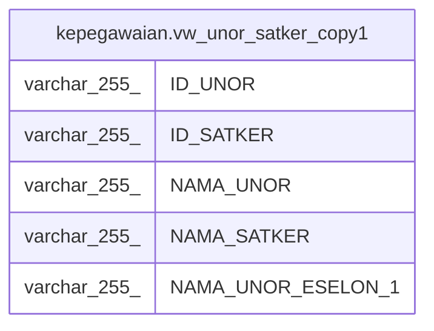

# kepegawaian.vw_unor_satker_copy1

## Description

Untuk Melihat Daftar Unit Kerja Berdasarkan Satkernya

<details>
<summary><strong>Table Definition</strong></summary>

```sql
CREATE VIEW vw_unor_satker_copy1 AS (
 SELECT a."ID" AS "ID_UNOR",
    b."ID" AS "ID_SATKER",
    a."NAMA_UNOR",
    b."NAMA_UNOR" AS "NAMA_SATKER",
    c."NAMA_UNOR" AS "NAMA_UNOR_ESELON_1"
   FROM ((kepegawaian.unitkerja a
     JOIN kepegawaian.unitkerja b ON (((b."ID")::text = (a."UNOR_INDUK")::text)))
     JOIN kepegawaian.unitkerja c ON (((a."ESELON_1")::text = (c."ID")::text)))
  WHERE ((a."UNOR_INDUK")::text IN ( SELECT unitkerja."ID"
           FROM kepegawaian.unitkerja unitkerja
          WHERE (unitkerja."IS_SATKER" = (1)::smallint)))
UNION ALL
 SELECT a."ID" AS "ID_UNOR",
    a."ID" AS "ID_SATKER",
    a."NAMA_UNOR",
    a."NAMA_UNOR" AS "NAMA_SATKER",
    b."NAMA_UNOR" AS "NAMA_UNOR_ESELON_1"
   FROM (kepegawaian.unitkerja a
     JOIN kepegawaian.unitkerja b ON (((b."ID")::text = (a."UNOR_INDUK")::text)))
  WHERE (a."IS_SATKER" = (1)::smallint)
)
```

</details>

## Columns

| Name | Type | Default | Nullable | Children | Parents | Comment |
| ---- | ---- | ------- | -------- | -------- | ------- | ------- |
| ID_UNOR | varchar(255) |  | true |  |  |  |
| ID_SATKER | varchar(255) |  | true |  |  |  |
| NAMA_UNOR | varchar(255) |  | true |  |  |  |
| NAMA_SATKER | varchar(255) |  | true |  |  |  |
| NAMA_UNOR_ESELON_1 | varchar(255) |  | true |  |  |  |

## Referenced Tables

| Name | Columns | Comment | Type |
| ---- | ------- | ------- | ---- |
| [kepegawaian.unitkerja](kepegawaian.unitkerja.md) | 30 |  | BASE TABLE |

## Relations



---

> Generated by [tbls](https://github.com/k1LoW/tbls)
