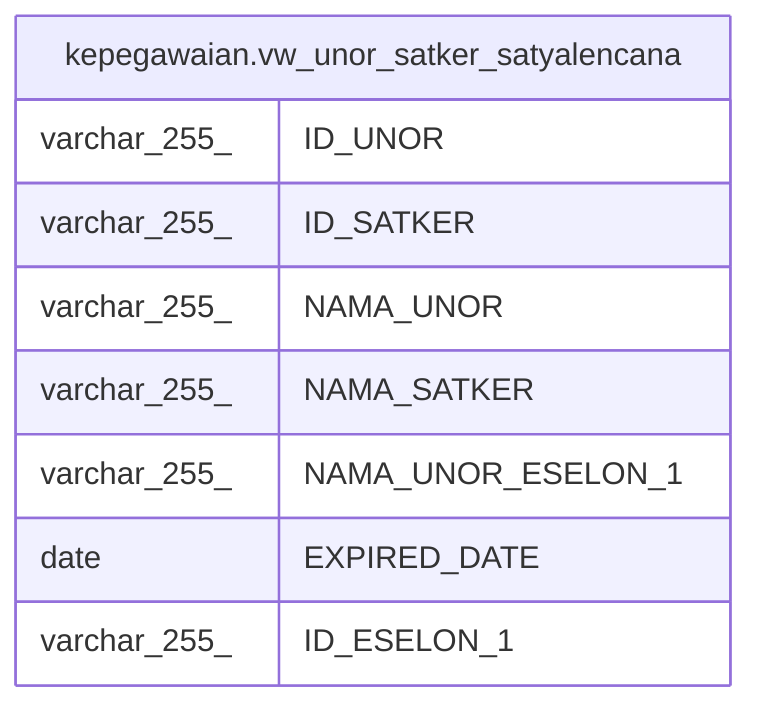

# kepegawaian.vw_unor_satker_satyalencana

## Description

<details>
<summary><strong>Table Definition</strong></summary>

```sql
CREATE VIEW vw_unor_satker_satyalencana AS (
 SELECT a."ID" AS "ID_UNOR",
    a."UNOR_INDUK" AS "ID_SATKER",
    a."NAMA_UNOR",
    b."NAMA_UNOR" AS "NAMA_SATKER",
    c."NAMA_UNOR_ESELON_1",
    a."EXPIRED_DATE",
    c.id_eselon_1 AS "ID_ESELON_1"
   FROM ((kepegawaian.unitkerja a
     JOIN kepegawaian.unitkerja b ON (((a."UNOR_INDUK")::text = (b."ID")::text)))
     JOIN ( WITH RECURSIVE r AS (
                 SELECT unitkerja."ID",
                    unitkerja."ID" AS id_eselon_1,
                    unitkerja."NAMA_UNOR" AS "NAMA_UNOR_ESELON_1"
                   FROM kepegawaian.unitkerja
                  WHERE ((unitkerja."DIATASAN_ID")::text = 'A8ACA7397AEB3912E040640A040269BB'::text)
                UNION ALL
                 SELECT a_1."ID",
                    r_1.id_eselon_1,
                    r_1."NAMA_UNOR_ESELON_1"
                   FROM (kepegawaian.unitkerja a_1
                     JOIN r r_1 ON (((a_1."DIATASAN_ID")::text = (r_1."ID")::text)))
                )
         SELECT r."ID",
            r.id_eselon_1,
            r."NAMA_UNOR_ESELON_1"
           FROM r) c ON (((a."ID")::text = (c."ID")::text)))
)
```

</details>

## Columns

| Name | Type | Default | Nullable | Children | Parents | Comment |
| ---- | ---- | ------- | -------- | -------- | ------- | ------- |
| ID_UNOR | varchar(255) |  | true |  |  |  |
| ID_SATKER | varchar(255) |  | true |  |  |  |
| NAMA_UNOR | varchar(255) |  | true |  |  |  |
| NAMA_SATKER | varchar(255) |  | true |  |  |  |
| NAMA_UNOR_ESELON_1 | varchar(255) |  | true |  |  |  |
| EXPIRED_DATE | date |  | true |  |  |  |
| ID_ESELON_1 | varchar(255) |  | true |  |  |  |

## Referenced Tables

| Name | Columns | Comment | Type |
| ---- | ------- | ------- | ---- |
| [kepegawaian.unitkerja](kepegawaian.unitkerja.md) | 30 |  | BASE TABLE |
| [r](r.md) | 0 |  |  |

## Relations



---

> Generated by [tbls](https://github.com/k1LoW/tbls)
