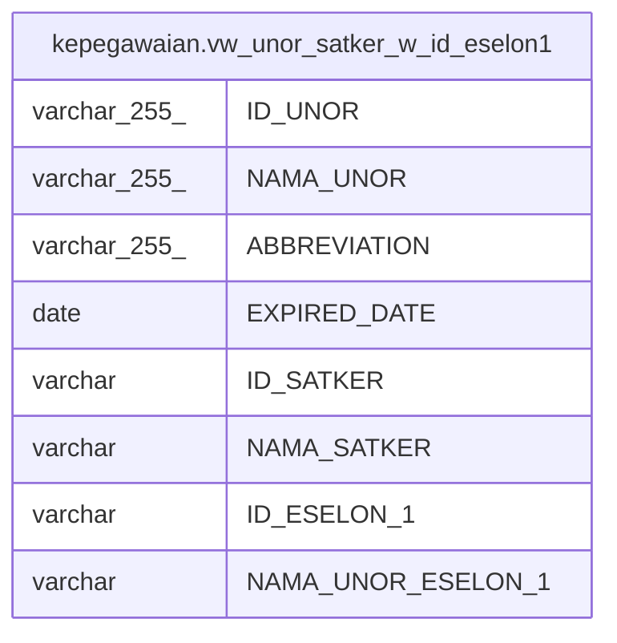

# kepegawaian.vw_unor_satker_w_id_eselon1

## Description

<details>
<summary><strong>Table Definition</strong></summary>

```sql
CREATE VIEW vw_unor_satker_w_id_eselon1 AS (
 SELECT "ID" AS "ID_UNOR",
    "NAMA_UNOR",
    "ABBREVIATION",
    "EXPIRED_DATE",
        CASE
            WHEN (btrim(("NAMA_UNOR")::text) = 'KEMENTERIAN PENDIDIKAN dan KEBUDAYAAN'::text) THEN "ID"
            WHEN (("ESELON_2" IS NULL) OR (btrim(("ESELON_2")::text) = ''::text)) THEN "ESELON_1"
            WHEN (btrim(("NAMA_UNOR_ESELON_1")::text) = 'universitas_dikti'::text) THEN "ESELON_2"
            WHEN (btrim(("NAMA_UNOR_ESELON_1")::text) = 'Politeknik Vokasi'::text) THEN "ESELON_2"
            WHEN ((btrim(("NAMA_UNOR_ESELON_1")::text) = 'Sekretariat Jenderal'::text) AND (btrim(("NAMA_UNOR_ESELON_2")::text) = 'Pusat Data dan Teknologi Informasi'::text) AND (btrim(("NAMA_UNOR_ESELON_3")::text) = 'Balai Pengembangan Multimedia Pendidikan dan Kebudayaan'::text)) THEN "ESELON_3"
            WHEN ((btrim(("NAMA_UNOR_ESELON_1")::text) = 'Sekretariat Jenderal'::text) AND (btrim(("NAMA_UNOR_ESELON_2")::text) = 'Pusat Data dan Teknologi Informasi'::text) AND (btrim(("NAMA_UNOR_ESELON_3")::text) = 'Balai Pengembangan Media Televisi Pendidikan dan Kebudayaan'::text)) THEN "ESELON_3"
            WHEN ((btrim(("NAMA_UNOR_ESELON_1")::text) = 'Sekretariat Jenderal'::text) AND (btrim(("NAMA_UNOR_ESELON_2")::text) = 'Pusat Data dan Teknologi Informasi'::text) AND (btrim(("NAMA_UNOR_ESELON_3")::text) = 'Balai Pengembangan Media Radio Pendidikan dan Kebudayaan'::text)) THEN "ESELON_3"
            ELSE "ESELON_2"
        END AS "ID_SATKER",
        CASE
            WHEN (btrim(("NAMA_UNOR")::text) = 'KEMENTERIAN PENDIDIKAN dan KEBUDAYAAN'::text) THEN "NAMA_UNOR"
            WHEN (("ESELON_2" IS NULL) OR (btrim(("ESELON_2")::text) = ''::text)) THEN "NAMA_UNOR_ESELON_1"
            WHEN (btrim(("NAMA_UNOR_ESELON_1")::text) = 'universitas_dikti'::text) THEN "NAMA_UNOR_ESELON_2"
            WHEN (btrim(("NAMA_UNOR_ESELON_1")::text) = 'Politeknik Vokasi'::text) THEN "NAMA_UNOR_ESELON_2"
            WHEN ((btrim(("NAMA_UNOR_ESELON_1")::text) = 'Sekretariat Jenderal'::text) AND (btrim(("NAMA_UNOR_ESELON_2")::text) = 'Pusat Data dan Teknologi Informasi'::text) AND (btrim(("NAMA_UNOR_ESELON_3")::text) = 'Balai Pengembangan Multimedia Pendidikan dan Kebudayaan'::text)) THEN "NAMA_UNOR_ESELON_3"
            WHEN ((btrim(("NAMA_UNOR_ESELON_1")::text) = 'Sekretariat Jenderal'::text) AND (btrim(("NAMA_UNOR_ESELON_2")::text) = 'Pusat Data dan Teknologi Informasi'::text) AND (btrim(("NAMA_UNOR_ESELON_3")::text) = 'Balai Pengembangan Media Televisi Pendidikan dan Kebudayaan'::text)) THEN "NAMA_UNOR_ESELON_3"
            WHEN ((btrim(("NAMA_UNOR_ESELON_1")::text) = 'Sekretariat Jenderal'::text) AND (btrim(("NAMA_UNOR_ESELON_2")::text) = 'Pusat Data dan Teknologi Informasi'::text) AND (btrim(("NAMA_UNOR_ESELON_3")::text) = 'Balai Pengembangan Media Radio Pendidikan dan Kebudayaan'::text)) THEN "NAMA_UNOR_ESELON_3"
            ELSE "NAMA_UNOR_ESELON_2"
        END AS "NAMA_SATKER",
        CASE
            WHEN (btrim(("NAMA_UNOR")::text) = 'KEMENTERIAN PENDIDIKAN dan KEBUDAYAAN'::text) THEN "ID"
            ELSE "ESELON_1"
        END AS "ID_ESELON_1",
        CASE
            WHEN (btrim(("NAMA_UNOR")::text) = 'KEMENTERIAN PENDIDIKAN dan KEBUDAYAAN'::text) THEN "NAMA_UNOR"
            ELSE "NAMA_UNOR_ESELON_1"
        END AS "NAMA_UNOR_ESELON_1"
   FROM kepegawaian.vw_unit_list_penyajian_data t
)
```

</details>

## Columns

| Name | Type | Default | Nullable | Children | Parents | Comment |
| ---- | ---- | ------- | -------- | -------- | ------- | ------- |
| ID_UNOR | varchar(255) |  | true |  |  |  |
| NAMA_UNOR | varchar(255) |  | true |  |  |  |
| ABBREVIATION | varchar(255) |  | true |  |  |  |
| EXPIRED_DATE | date |  | true |  |  |  |
| ID_SATKER | varchar |  | true |  |  |  |
| NAMA_SATKER | varchar |  | true |  |  |  |
| ID_ESELON_1 | varchar |  | true |  |  |  |
| NAMA_UNOR_ESELON_1 | varchar |  | true |  |  |  |

## Referenced Tables

| Name | Columns | Comment | Type |
| ---- | ------- | ------- | ---- |
| [kepegawaian.vw_unit_list_penyajian_data](kepegawaian.vw_unit_list_penyajian_data.md) | 31 |  | MATERIALIZED VIEW |

## Relations



---

> Generated by [tbls](https://github.com/k1LoW/tbls)
