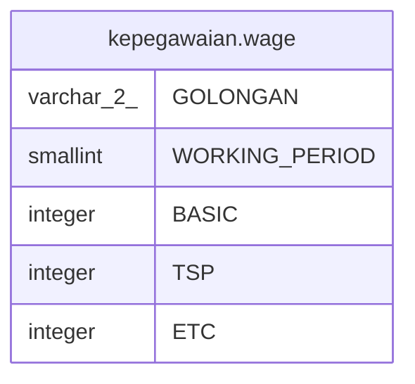

# kepegawaian.wage

## Description

## Columns

| Name | Type | Default | Nullable | Children | Parents | Comment |
| ---- | ---- | ------- | -------- | -------- | ------- | ------- |
| GOLONGAN | varchar(2) |  | false |  |  |  |
| WORKING_PERIOD | smallint |  | false |  |  |  |
| BASIC | integer |  | true |  |  |  |
| TSP | integer |  | true |  |  |  |
| ETC | integer |  | true |  |  |  |

## Constraints

| Name | Type | Definition |
| ---- | ---- | ---------- |
| wage_pkey | PRIMARY KEY | PRIMARY KEY ("GOLONGAN", "WORKING_PERIOD") |

## Indexes

| Name | Definition |
| ---- | ---------- |
| wage_pkey | CREATE UNIQUE INDEX wage_pkey ON kepegawaian.wage USING btree ("GOLONGAN", "WORKING_PERIOD") |

## Relations

---

> Generated by [tbls](https://github.com/k1LoW/tbls)
