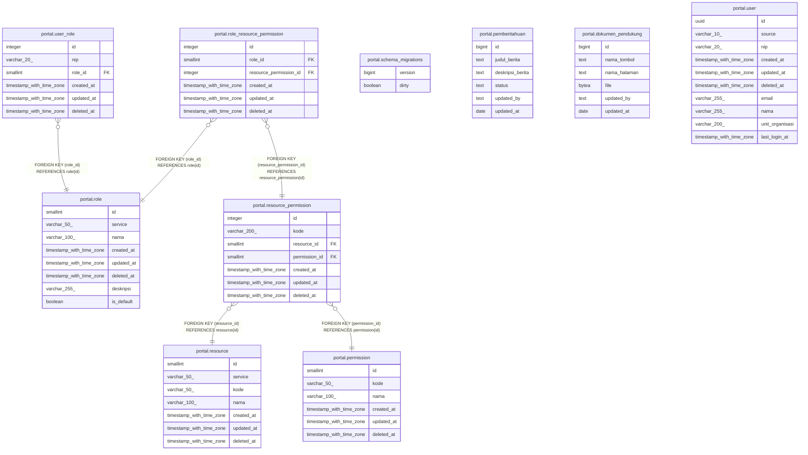

# nexus

## Tables

| Name | Columns | Comment | Type |
| ---- | ------- | ------- | ---- |
| [portal.schema_migrations](portal.schema_migrations.md) | 2 |  | BASE TABLE |
| [portal.pemberitahuan](portal.pemberitahuan.md) | 6 |  | BASE TABLE |
| [portal.dokumen_pendukung](portal.dokumen_pendukung.md) | 6 |  | BASE TABLE |
| [portal.user](portal.user.md) | 10 |  | BASE TABLE |
| [portal.role](portal.role.md) | 8 |  | BASE TABLE |
| [portal.user_role](portal.user_role.md) | 6 |  | BASE TABLE |
| [portal.resource](portal.resource.md) | 7 |  | BASE TABLE |
| [portal.permission](portal.permission.md) | 6 |  | BASE TABLE |
| [portal.resource_permission](portal.resource_permission.md) | 7 |  | BASE TABLE |
| [portal.role_resource_permission](portal.role_resource_permission.md) | 6 |  | BASE TABLE |

## Stored procedures and functions

| Name | ReturnType | Arguments | Type |
| ---- | ------- | ------- | ---- |
| portal.resource_permission_set_kode | trigger |  | FUNCTION |
| portal.resource_update_resource_permission_kode | trigger |  | FUNCTION |
| portal.permission_update_resource_permission_kode | trigger |  | FUNCTION |
| public.is_user_has_access | bool | p_nip text, p_kode text | FUNCTION |

## Relations

---

> Generated by [tbls](https://github.com/k1LoW/tbls)
