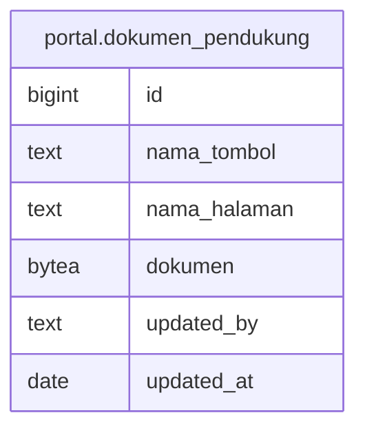

# portal.dokumen_pendukung

## Description

## Columns

| Name | Type | Default | Nullable | Children | Parents | Comment |
| ---- | ---- | ------- | -------- | -------- | ------- | ------- |
| id | bigint | nextval('dokumen_pendukung_id_seq'::regclass) | false |  |  |  |
| nama_tombol | text |  | false |  |  |  |
| nama_halaman | text |  | false |  |  |  |
| dokumen | bytea |  | true |  |  |  |
| updated_by | text |  | true |  |  |  |
| updated_at | date |  | true |  |  |  |

## Constraints

| Name | Type | Definition |
| ---- | ---- | ---------- |
| dokumen_pendukung_pkey | PRIMARY KEY | PRIMARY KEY (id) |

## Indexes

| Name | Definition |
| ---- | ---------- |
| dokumen_pendukung_pkey | CREATE UNIQUE INDEX dokumen_pendukung_pkey ON portal.dokumen_pendukung USING btree (id) |

## Relations

---

> Generated by [tbls](https://github.com/k1LoW/tbls)
