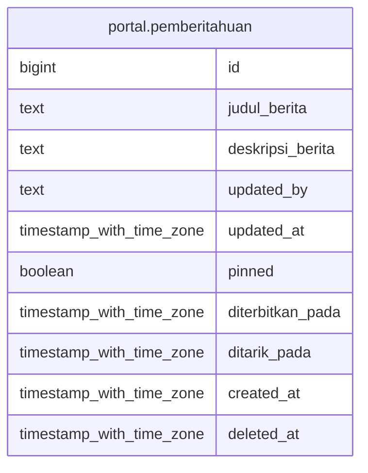

# portal.pemberitahuan

## Description

## Columns

| Name | Type | Default | Nullable | Children | Parents | Comment |
| ---- | ---- | ------- | -------- | -------- | ------- | ------- |
| id | bigint | nextval('pemberitahuan_id_seq'::regclass) | false |  |  |  |
| judul_berita | text |  | false |  |  |  |
| deskripsi_berita | text |  | false |  |  |  |
| updated_by | text |  | false |  |  |  |
| updated_at | timestamp with time zone | now() | false |  |  |  |
| pinned | boolean | false | false |  |  |  |
| diterbitkan_pada | timestamp with time zone |  | false |  |  |  |
| ditarik_pada | timestamp with time zone |  | false |  |  |  |
| created_at | timestamp with time zone | now() | false |  |  |  |
| deleted_at | timestamp with time zone |  | true |  |  |  |

## Constraints

| Name | Type | Definition |
| ---- | ---- | ---------- |
| pemberitahuan_pkey | PRIMARY KEY | PRIMARY KEY (id) |

## Indexes

| Name | Definition |
| ---- | ---------- |
| pemberitahuan_pkey | CREATE UNIQUE INDEX pemberitahuan_pkey ON portal.pemberitahuan USING btree (id) |
| pemberitahuan_judul_idx | CREATE INDEX pemberitahuan_judul_idx ON portal.pemberitahuan USING btree (judul_berita) |
| pemberitahuan_deskripsi_idx | CREATE INDEX pemberitahuan_deskripsi_idx ON portal.pemberitahuan USING btree (deskripsi_berita) |

## Relations

---

> Generated by [tbls](https://github.com/k1LoW/tbls)
