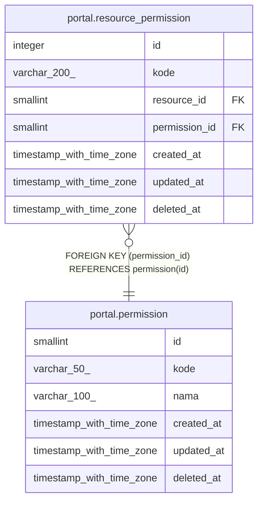

# portal.permission

## Description

## Columns

| Name | Type | Default | Nullable | Children | Parents | Comment |
| ---- | ---- | ------- | -------- | -------- | ------- | ------- |
| id | smallint | nextval('permission_id_seq'::regclass) | false | [portal.resource_permission](portal.resource_permission.md) |  |  |
| kode | varchar(50) |  | false |  |  |  |
| nama | varchar(100) |  | false |  |  |  |
| created_at | timestamp with time zone | now() | true |  |  |  |
| updated_at | timestamp with time zone | now() | true |  |  |  |
| deleted_at | timestamp with time zone |  | true |  |  |  |

## Constraints

| Name | Type | Definition |
| ---- | ---- | ---------- |
| permission_pkey | PRIMARY KEY | PRIMARY KEY (id) |

## Indexes

| Name | Definition |
| ---- | ---------- |
| permission_pkey | CREATE UNIQUE INDEX permission_pkey ON portal.permission USING btree (id) |
| permission_kode_unique_idx | CREATE UNIQUE INDEX permission_kode_unique_idx ON portal.permission USING btree (kode) WHERE (deleted_at IS NULL) |

## Triggers

| Name | Definition |
| ---- | ---------- |
| permission_update_resource_permission_kode | CREATE TRIGGER permission_update_resource_permission_kode AFTER UPDATE OF kode, deleted_at ON portal.permission FOR EACH ROW EXECUTE FUNCTION permission_update_resource_permission_kode() |

## Relations

---

> Generated by [tbls](https://github.com/k1LoW/tbls)
