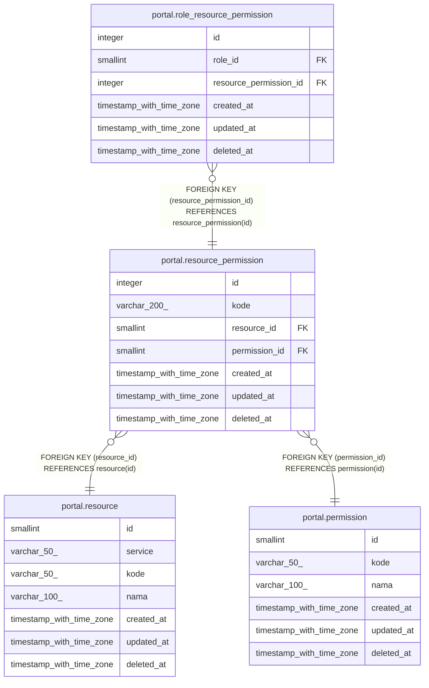

# portal.resource_permission

## Description

## Columns

| Name | Type | Default | Nullable | Children | Parents | Comment |
| ---- | ---- | ------- | -------- | -------- | ------- | ------- |
| id | integer | nextval('resource_permission_id_seq'::regclass) | false | [portal.role_resource_permission](portal.role_resource_permission.md) |  |  |
| kode | varchar(200) |  | true |  |  |  |
| resource_id | smallint |  | false |  | [portal.resource](portal.resource.md) |  |
| permission_id | smallint |  | false |  | [portal.permission](portal.permission.md) |  |
| created_at | timestamp with time zone | now() | true |  |  |  |
| updated_at | timestamp with time zone | now() | true |  |  |  |
| deleted_at | timestamp with time zone |  | true |  |  |  |

## Constraints

| Name | Type | Definition |
| ---- | ---- | ---------- |
| resource_permission_resource_id_fkey | FOREIGN KEY | FOREIGN KEY (resource_id) REFERENCES resource(id) |
| resource_permission_permission_id_fkey | FOREIGN KEY | FOREIGN KEY (permission_id) REFERENCES permission(id) |
| resource_permission_pkey | PRIMARY KEY | PRIMARY KEY (id) |

## Indexes

| Name | Definition |
| ---- | ---------- |
| resource_permission_pkey | CREATE UNIQUE INDEX resource_permission_pkey ON portal.resource_permission USING btree (id) |
| resource_permission_kode_unique_idx | CREATE UNIQUE INDEX resource_permission_kode_unique_idx ON portal.resource_permission USING btree (kode) WHERE (deleted_at IS NULL) |
| resource_permission_resource_id_idx | CREATE INDEX resource_permission_resource_id_idx ON portal.resource_permission USING btree (resource_id) |
| resource_permission_permission_id_idx | CREATE INDEX resource_permission_permission_id_idx ON portal.resource_permission USING btree (permission_id) |

## Triggers

| Name | Definition |
| ---- | ---------- |
| resource_permission_set_kode | CREATE TRIGGER resource_permission_set_kode BEFORE INSERT OR UPDATE OF resource_id, permission_id ON portal.resource_permission FOR EACH ROW EXECUTE FUNCTION resource_permission_set_kode() |

## Relations

---

> Generated by [tbls](https://github.com/k1LoW/tbls)
