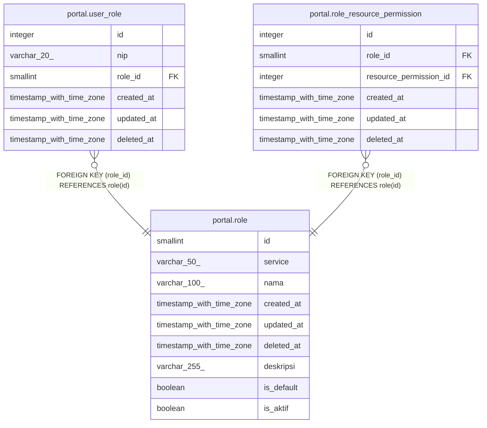

# portal.role

## Description

## Columns

| Name | Type | Default | Nullable | Children | Parents | Comment |
| ---- | ---- | ------- | -------- | -------- | ------- | ------- |
| id | smallint | nextval('role_id_seq'::regclass) | false | [portal.user_role](portal.user_role.md) [portal.role_resource_permission](portal.role_resource_permission.md) |  |  |
| service | varchar(50) |  | true |  |  | deprecated |
| nama | varchar(100) |  | false |  |  |  |
| created_at | timestamp with time zone | now() | true |  |  |  |
| updated_at | timestamp with time zone | now() | true |  |  |  |
| deleted_at | timestamp with time zone |  | true |  |  |  |
| deskripsi | varchar(255) |  | true |  |  |  |
| is_default | boolean | false | false |  |  |  |
| is_aktif | boolean | true | false |  |  |  |

## Constraints

| Name | Type | Definition |
| ---- | ---- | ---------- |
| role_pkey | PRIMARY KEY | PRIMARY KEY (id) |

## Indexes

| Name | Definition |
| ---- | ---------- |
| role_pkey | CREATE UNIQUE INDEX role_pkey ON portal.role USING btree (id) |
| role_is_default_idx | CREATE INDEX role_is_default_idx ON portal.role USING btree (is_default) |

## Relations

---

> Generated by [tbls](https://github.com/k1LoW/tbls)
