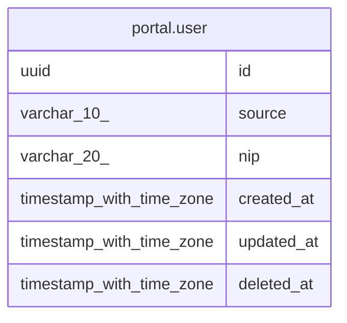

# portal.user

## Description

## Columns

| Name | Type | Default | Nullable | Children | Parents | Comment |
| ---- | ---- | ------- | -------- | -------- | ------- | ------- |
| id | uuid |  | false |  |  |  |
| source | varchar(10) |  | false |  |  |  |
| nip | varchar(20) |  | false |  |  |  |
| created_at | timestamp with time zone | now() | true |  |  |  |
| updated_at | timestamp with time zone | now() | true |  |  |  |
| deleted_at | timestamp with time zone |  | true |  |  |  |

## Constraints

| Name | Type | Definition |
| ---- | ---- | ---------- |
| user_pkey | PRIMARY KEY | PRIMARY KEY (id, source) |

## Indexes

| Name | Definition |
| ---- | ---------- |
| user_pkey | CREATE UNIQUE INDEX user_pkey ON portal."user" USING btree (id, source) |

## Relations

---

> Generated by [tbls](https://github.com/k1LoW/tbls)
