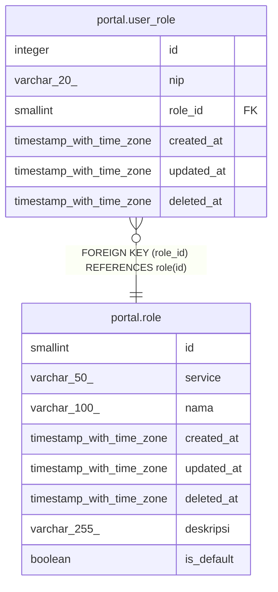

# portal.user_role

## Description

## Columns

| Name | Type | Default | Nullable | Children | Parents | Comment |
| ---- | ---- | ------- | -------- | -------- | ------- | ------- |
| id | integer | nextval('user_role_id_seq'::regclass) | false |  |  |  |
| nip | varchar(20) |  | false |  |  |  |
| role_id | smallint |  | false |  | [portal.role](portal.role.md) |  |
| created_at | timestamp with time zone | now() | true |  |  |  |
| updated_at | timestamp with time zone | now() | true |  |  |  |
| deleted_at | timestamp with time zone |  | true |  |  |  |

## Constraints

| Name | Type | Definition |
| ---- | ---- | ---------- |
| user_role_pkey | PRIMARY KEY | PRIMARY KEY (id) |
| user_role_role_id_fkey | FOREIGN KEY | FOREIGN KEY (role_id) REFERENCES role(id) |

## Indexes

| Name | Definition |
| ---- | ---------- |
| user_role_pkey | CREATE UNIQUE INDEX user_role_pkey ON portal.user_role USING btree (id) |
| user_role_nip_role_id_unique_idx | CREATE UNIQUE INDEX user_role_nip_role_id_unique_idx ON portal.user_role USING btree (nip, role_id) WHERE (deleted_at IS NULL) |
| user_role_role_id_idx | CREATE INDEX user_role_role_id_idx ON portal.user_role USING btree (role_id) |

## Relations

---

> Generated by [tbls](https://github.com/k1LoW/tbls)
