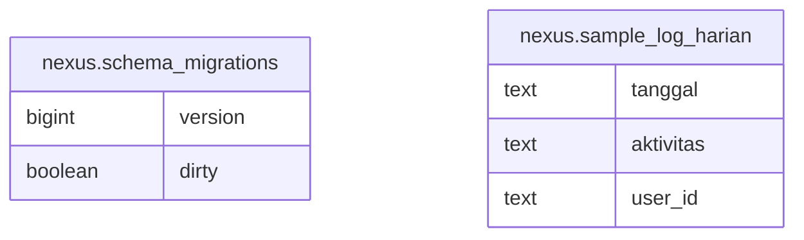

# postgres

## Tables

| Name | Columns | Comment | Type |
| ---- | ------- | ------- | ---- |
| [nexus.schema_migrations](nexus.schema_migrations.md) | 2 |  | BASE TABLE |
| [nexus.sample_log_harian](nexus.sample_log_harian.md) | 3 |  | BASE TABLE |

## Relations

---

> Generated by [tbls](https://github.com/k1LoW/tbls)
